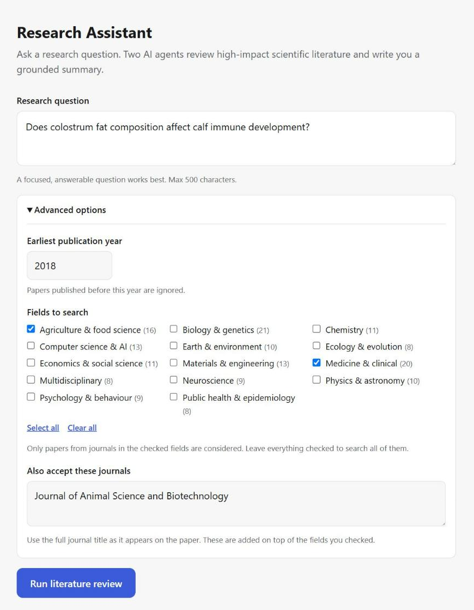
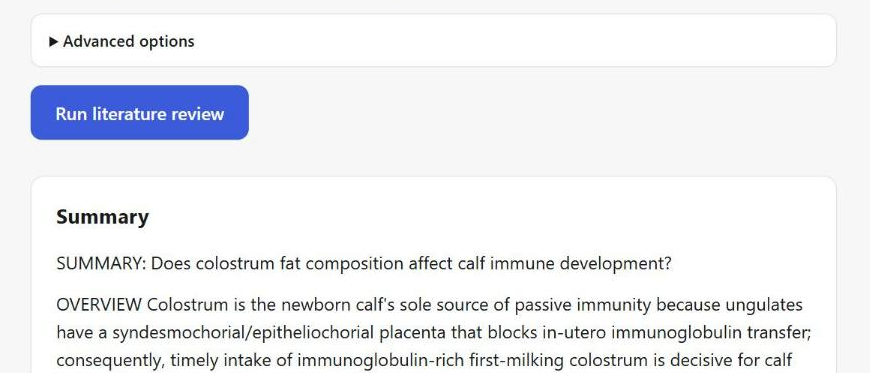
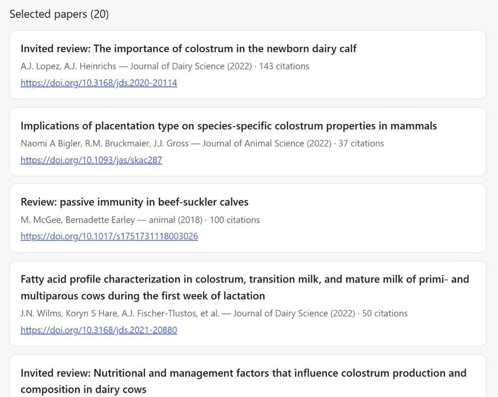

# Research Assistant

[](https://github.com/yasminreich/Agentic-research-assistant/actions/workflows/ci.yml)
[](LICENSE)
[](https://www.python.org/downloads/)

Ask a research question in your browser and get a clear, cited summary of the
scientific literature — written by AI agents that search real papers and focus on
high-impact journals.



Ask a question, pick the fields it belongs to, and get a grounded summary:



…followed by every paper it drew on, with journal, year, citation count and a
resolvable DOI:



**[→ Read a full report end to end](docs/example-report.md)** — 25 papers, every
citation resolvable. Nothing in it was written by hand.

## How it works

Two AI agents (built on the AG2 / AutoGen framework) work together on each question:

- **Researcher agent** — powered by Claude. It plans a few search queries, judges
  which returned papers are actually relevant, groups papers that reach the same
  conclusion (keeping the most recent), and writes the final cited summary.
- **Proxy agent** — runs the searches the Researcher asks for, against
  **OpenAlex**, a free open database of scientific papers (codenamed "Paperclip" in
  the code).

Results are filtered to a curated list of **high-impact journals**, **deduplicated
by recency** (when several papers agree, the most recent one wins), and saved to the
`output/` folder as JSON and Markdown.

```
You ask a question
   → Researcher plans a few search queries
   → Proxy searches OpenAlex for real papers
        → filtered to the journal fields you chose
        → near-duplicate papers collapsed, most recent kept
   → Researcher judges relevance and writes a cited summary
   → the report is saved to output/<timestamp>-<slug>.json + .md
```

The deterministic parts (searching, the journal allowlist, deduplication) are plain
Python so they're auditable; the judgment calls (relevance, "same conclusion") are
the Researcher's.

## Quick start

You need **Python 3.10+** and an **Anthropic API key** (from
[console.anthropic.com](https://console.anthropic.com/)). Paper search uses
[OpenAlex](https://openalex.org/), which is free and needs no key.

```bash
# 1. Install the dependencies
pip install -r requirements.txt

# 2. Add your API key
cp .env.example .env          # Windows PowerShell: Copy-Item .env.example .env
# then open .env and set:  ANTHROPIC_API_KEY=sk-ant-...

# 3. Start it
python run.py
```

Now open **http://localhost:8000**, type a question, and click **Run literature
review**. A run takes about 1–2 minutes. That's it. 🎉

Each run also saves a full report (summary + every paper) to the `output/` folder
as JSON and Markdown.

## Choosing which journals count

This is the setting that most affects your results. Open **Advanced options** on
the page.

The allowlist covers **167 journals across 14 fields**. By default all of them are
searched, which is usually not what you want — a question about calf nutrition
returns better papers when you narrow to *Agriculture & food science* than when
*Physics* and *Economics* are competing for the same slots.

| | | |
|---|---|---|
| Multidisciplinary | Medicine & clinical | Biology & genetics |
| Neuroscience | Chemistry | Physics & astronomy |
| Materials & engineering | Computer science & AI | Earth & environment |
| Ecology & evolution | Agriculture & food science | Psychology & behaviour |
| Economics & social science | Public health & epidemiology | |

Three controls:

- **Fields to search** — check the disciplines your question belongs to.
- **Also accept these journals** — paste full journal titles, one per line, for
  venues the list doesn't cover. Use the title exactly as it appears on the paper
  (*Journal of Dairy Science*, not *Dairy Science*).
- **Earliest publication year** — defaults to `MIN_YEAR` from your `.env`.

**Got no papers back?** The page lists the journals your filter excluded, with
counts. Paste the ones you trust into the custom box and run again. That list is
almost always the answer — the venue filter is a far more common cause of an empty
result than a genuine absence of literature.

To change the allowlist permanently, edit `JOURNALS_BY_FIELD` in
[`app/journals.py`](app/journals.py). It's the single source of truth, and the web
page builds its checkboxes from it via `GET /journals`.

## Share it with others

Want other people to try it from a link — no install, no key on their end? Deploy
it once and share the URL. It runs on **your** API key, so cap your spending first.

1. **Set a spend limit** at [console.anthropic.com](https://console.anthropic.com/)
   → Settings → Limits (e.g. $15/month). This is your safety net — a run costs
   roughly **$0.15–$1.00**.
2. **Deploy to [Render](https://render.com/)** (free tier): sign in with GitHub →
   **New + → Blueprint** → pick this repo → set `ANTHROPIC_API_KEY` → **Apply**.
   You get a public URL in a few minutes. (The included `Dockerfile` and
   `render.yaml` do the setup; Railway and Fly.io work the same way.)
3. **Share the URL.** Optionally set `ACCESS_PASSWORD` so only people you give the
   password to can use it.

## Common settings

Everything is configured in `.env` (see `.env.example`). The only **required**
value is `ANTHROPIC_API_KEY`. The handy optional ones:

| Setting | Default | What it does |
|---|---|---|
| `ACCESS_PASSWORD` | *(blank)* | Password for the web page. Blank = anyone with the link can use it. |
| `MAX_RUNS_PER_DAY` | `50` | Daily cap on runs — bounds your cost. |
| `MIN_YEAR` | `2015` | Default earliest year (overridable per run in the UI). |
| `MAX_PAPERS_PER_QUERY` | `50` | Papers fetched per search. |

## Development

```bash
pip install -r requirements.txt -r requirements-dev.txt

pytest                  # 233 tests, no network and no API key needed
ruff check . && ruff format --check .
```

The suite is entirely offline — `PaperclipClient` takes an injected
`requests.Session` and `ResearchTools` takes an injected client, so nothing in
`tests/` makes a real call or spends money. CI runs the same three commands on
Python 3.10, 3.11 and 3.12.

The live checks are separate and deliberately manual:

```bash
python -m scripts.smoke_test    # one real OpenAlex search + one real Claude call
```

## Limitations

Worth knowing before you rely on it:

- **The allowlist is curated and finite.** 167 journals is a deliberate quality
  filter, not full coverage of the literature. Good papers in smaller or newer
  venues are excluded unless you name them. The excluded-journals list on each run
  tells you what you're missing.
- **A run is a single blocking request** of 1–2 minutes. There's no job queue and
  no progress streaming; the page waits with a 3-minute timeout. On Render's free
  tier a cold start eats into that.
- **The daily run cap is per-process and in-memory.** It resets on restart or
  redeploy, and multiple workers each keep their own count. Your real spending
  guarantee is the Anthropic Console limit — set that too.
- **The summary is the model's synthesis.** Every paper it cites is real and
  resolvable, but the reading of them is Claude's, not a peer reviewer's.

## API

The web page is a front end for one endpoint. You can call it directly:

```bash
curl -X POST http://localhost:8000/research \
  -H "Content-Type: application/json" \
  -d '{
        "question": "Does colostrum fat composition affect calf immune development?",
        "fields": ["agriculture_food", "medicine"],
        "min_year": 2018
      }'
```

On Windows PowerShell use `Invoke-RestMethod`.

| Endpoint | Purpose |
|---|---|
| `POST /research` | Run a review. Body: `question`, optional `fields`, `extra_journals`, `min_year`. Header `X-Access-Password` when a password is set. |
| `GET /journals` | The field list with labels and journal counts. |
| `GET /config` | UI hints: whether a password is required, `min_year`, `max_question_chars`. |
| `GET /health` | Liveness check. |

Interactive docs are at `/docs` once the server is running.

`fields` has three meanings: omitted or `null` searches every field; a list
searches those fields; an **empty list** searches no field, so only
`extra_journals` applies. A request with neither is rejected — it could only ever
return nothing.

<details>
<summary><b>More details</b></summary>

### All settings

| Variable | Default | Purpose |
|---|---|---|
| `ANTHROPIC_API_KEY` | — | **Required.** Claude access for the Researcher. |
| `OPENALEX_MAILTO` | — | Optional; your email for OpenAlex's faster "polite pool". |
| `CLAUDE_MODEL` | `claude-opus-4-8` | Model for the Researcher. Check current model IDs before changing. |
| `MIN_YEAR` | `2015` | Default earliest publication year. |
| `MAX_PAPERS_PER_QUERY` | `50` | Results requested per query (the API caps at 200). |
| `MAX_AGENT_TURNS` | `15` | Safety cap on automatic agent turns per run. |
| `OUTPUT_DIR` | `output` | Where reports are written. |
| `ACCESS_PASSWORD` | — | Shared password for the web UI. Blank = no gate. |
| `MAX_RUNS_PER_DAY` | `50` | In-app cap on runs per day (UTC). |
| `MAX_QUESTION_CHARS` | `500` | Reject questions longer than this. |

### Project layout

```
app/
  config.py            # settings (pydantic-settings)
  paperclip_client.py  # OpenAlex Works API client
  journals.py          # journal fields, allowlist, JournalPolicy
  filters.py           # policy filter, recency dedup, excluded-journal counts
  tools.py             # search / save tools the agents call
  agents.py            # Researcher + Proxy agents
  workflow.py          # run_research() orchestration
  persistence.py       # JSON + Markdown report writer
  server.py            # FastAPI app: web page + /research + /journals + /health
  limits.py            # in-memory per-day run cap
  static/index.html    # the web page (served at /)
tests/                 # 233 offline tests
scripts/smoke_test.py  # live pre-flight checks
run.py                 # launcher
Dockerfile, render.yaml  # deployment
```

### Troubleshooting

**"No papers matched your journal filter."** Open Advanced options and check more
fields, or paste the excluded journal names the page shows you into *Also accept
these journals*.

**`400` error about `temperature` from Claude.** Opus 4.8 rejects sampling
parameters, which AG2 sends by default. This is handled automatically by
`app/anthropic_compat.py`. If Claude calls start failing this way after an AG2
upgrade, that shim is where to look — `tests/test_anthropic_compat.py` pins the
assumption it relies on.

**OpenAlex `429` (rate limit).** Rare; the client retries automatically. Setting
`OPENALEX_MAILTO` to your email moves you into OpenAlex's faster pool.

</details>

## License

MIT — see [LICENSE](LICENSE).
