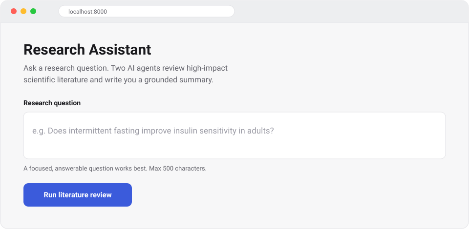

# Research Assistant

Ask a research question in your browser and get a clear, cited summary of the
scientific literature — written by AI agents that search real papers and focus on
high-impact journals.



## Quick start

You need **Python 3.10+** and an **Anthropic API key** (from
[console.anthropic.com](https://console.anthropic.com/)). Paper search uses
[OpenAlex](https://openalex.org/), which is free and needs no key.

```bash
# 1. Install the dependencies
pip install -r requirements.txt

# 2. Add your API key
cp .env.example .env          # Windows PowerShell: Copy-Item .env.example .env
# then open .env and set:  ANTHROPIC_API_KEY=sk-ant-...

# 3. Start it
python run.py
```

Now open **http://localhost:8000**, type a question, and click **Run literature
review**. A run takes about 1–2 minutes. That's it. 🎉

Each run also saves a full report (summary + every paper) to the `output/` folder
as JSON and Markdown.

## Share it with others

Want other people to try it from a link — no install, no key on their end? Deploy
it once and share the URL. It runs on **your** API key, so cap your spending first.

1. **Set a spend limit** at [console.anthropic.com](https://console.anthropic.com/)
   → Settings → Limits (e.g. $15/month). This is your safety net — a run costs
   roughly **$0.15–$1.00**.
2. **Deploy to [Render](https://render.com/)** (free tier): sign in with GitHub →
   **New + → Blueprint** → pick this repo → set `ANTHROPIC_API_KEY` → **Apply**.
   You get a public URL in a few minutes. (The included `Dockerfile` and
   `render.yaml` do the setup; Railway and Fly.io work the same way.)
3. **Share the URL.** Optionally set `ACCESS_PASSWORD` so only people you give the
   password to can use it.

## Common settings

Everything is configured in `.env` (see `.env.example`). The only **required**
value is `ANTHROPIC_API_KEY`. The handy optional ones:

| Setting | Default | What it does |
|---|---|---|
| `ACCESS_PASSWORD` | *(blank)* | Password for the web page. Blank = anyone with the link can use it. |
| `MAX_RUNS_PER_DAY` | `50` | Daily cap on runs — bounds your cost. |
| `MIN_YEAR` | `2015` | Ignore papers older than this year. |
| `MAX_PAPERS_PER_QUERY` | `50` | Papers fetched per search. |

---

<details>
<summary><b>How it works & advanced details</b></summary>

### How it works

```
You ask a question
   → Researcher agent (Claude) plans a few search queries
   → Proxy agent searches OpenAlex for real papers
        → results filtered to a curated high-impact journal list
        → near-duplicate papers collapsed, most recent kept
   → Researcher judges relevance and writes a cited summary
   → the report is saved to output/<timestamp>-<slug>.json + .md
```

Two agents (built on the AG2 / AutoGen framework) do the work: a **Researcher**
(Claude `claude-opus-4-8`) that plans and writes, and a **Proxy** that runs the
searches. The deterministic parts (searching, the journal allowlist, deduplication)
are plain Python so they're auditable; the judgment calls (relevance, "same
conclusion") are the Researcher's.

The paper source is codenamed **Paperclip** in the code — it's just OpenAlex behind
`app/paperclip_client.py`.

### Use it from the API instead of the browser

The web page is a front end for one endpoint. You can call it directly:

```bash
curl -X POST http://localhost:8000/research \
  -H "Content-Type: application/json" \
  -d '{"question": "Does intermittent fasting improve insulin sensitivity in adults?"}'
```

On Windows PowerShell use `Invoke-RestMethod`:

```powershell
Invoke-RestMethod -Uri http://localhost:8000/research -Method Post `
  -ContentType "application/json" `
  -Body '{"question": "Does intermittent fasting improve insulin sensitivity in adults?"}'
```

The response includes the summary, paper count, and the saved file paths.

### Check your setup

```bash
python -m scripts.smoke_test
```

Confirms the OpenAlex search works (no key needed) and — if `ANTHROPIC_API_KEY` is
set — that a single Claude call succeeds.

### All settings

| Variable | Default | Purpose |
|---|---|---|
| `ANTHROPIC_API_KEY` | — | **Required.** Claude access for the Researcher. |
| `OPENALEX_MAILTO` | — | Optional; your email for OpenAlex's faster "polite pool". |
| `CLAUDE_MODEL` | `claude-opus-4-8` | Model for the Researcher. |
| `MIN_YEAR` | `2015` | Earliest publication year considered. |
| `MAX_PAPERS_PER_QUERY` | `50` | Results requested per query (API caps at 200). |
| `MAX_AGENT_TURNS` | `15` | Safety cap on automatic agent turns per run. |
| `OUTPUT_DIR` | `output` | Where reports are written. |
| `ACCESS_PASSWORD` | — | Shared password for the web UI. Blank = no gate. |
| `MAX_RUNS_PER_DAY` | `50` | In-app cap on runs per day (UTC). |
| `MAX_QUESTION_CHARS` | `500` | Reject questions longer than this. |

### Change which journals count as "high-impact"

Edit the allowlist in [`app/journals.py`](app/journals.py) — `HIGH_IMPACT_JOURNALS`
(normalized, lowercase) and `ALIASES` (abbreviations). It's the single source of
truth for that policy.

### Project layout

```
app/
  config.py            # settings (pydantic-settings)
  paperclip_client.py  # OpenAlex Works API client
  journals.py          # high-impact journal allowlist + matcher
  filters.py           # high-impact filter + recency dedup
  tools.py             # search / save tools the agents call
  agents.py            # Researcher + Proxy agents
  workflow.py          # run_research() orchestration
  persistence.py       # JSON + Markdown report writer
  server.py            # FastAPI app: web page + /research + /health
  limits.py            # in-memory per-day run cap
  static/index.html    # the web page (served at /)
scripts/smoke_test.py  # pre-flight checks
run.py                 # launcher
Dockerfile, render.yaml  # deployment
```

### Troubleshooting

**`400` error about `temperature` from Claude.** Opus 4.8 rejects sampling
parameters, which AG2 sends by default. This is handled automatically by
`app/anthropic_compat.py`. Run `python -m scripts.smoke_test` to confirm the LLM
path.

**OpenAlex `429` (rate limit).** Rare; the client retries automatically. Setting
`OPENALEX_MAILTO` to your email moves you into OpenAlex's faster pool.

</details>
